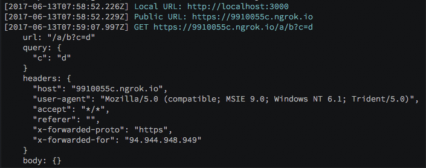

# Webhooks Tester

Install:

```bash
npm install -g webhooks-tester
```

Run:

```bash
webhooks-tester
```

You can then call the internal or public URL and the full request will be shown in the console:


